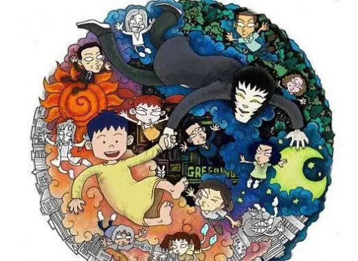

# 2023-1-6  

### 相比较于刚回家那几天，学习情况好了很多，有以下几点做到了

-  坚持每天背100个单词，复习300个，目前坚持了六天，但是随着单词往后，新词认识的开始减少，背的难度有点上升，希望可以继续坚持

- 起床的时间早了一点，基本上可以做到八点之前起床，一般在七点半左右就能起来

### 有几点还是没能做到，具体如下

- 早上还是没做到七点起床，这就导致背单词，有时候会拖延到吃完早饭，这就耽误了数学的学习，往往上午就没有两个小时这样的时间块去学习数学

- 再者就是数学课程问题，目前感觉在解题方面张宇讲得很不错，但是，确实有些基础的东西没讲到，武钟祥节奏太慢了，而且感觉解题方法不是特别灵活，或许可能会把两个老师的课都看一遍吧，做题方面主要就是1800，感觉1800确实题有点多了，重复率比较高，让学习进度变得很慢，下个阶段考虑会去做660，在闲暇了再去做1800或者说后期时间充足的时候

- 最差的一点，迟迟没能做到，就是晚上的学习时间，我给自己预留了玩的时间，晚上八点之前，之后的时间本来是安排看英语期刊，但是一直没做到，下个阶段争取做到看一篇期刊，然后做一点笔记，结束后把当天的英语单词复习一遍，耗费的时间大概在一个小时左右，晚上暂时不安排太久，循序渐进。

### 有关学习的大概就这么多，接下来新增了一个topic关于一部动画片

最近在看一部动画片《小明与王猫》，一部许多年前的片子，画质很粗糙，但是剧情我觉得很出色，王猫是住在小明卧室墙里的一个大朋友，总能给小明的疑惑提供很好的解释，其中印象比较深的是关于介绍自己的那一集，王猫说，大部分家长都不希望关于自己的东西被自己家小朋友说出去，比如经济情况，这是大人所不愿意的，小明问为什么，王猫说这是大人才会知道的事情，只有长大了才能懂，顿时感觉到了什么是一个好的沟通，还有关于周娜，她觉得爸爸一定是因为喜欢拉小提琴才努力的，后来穿越回过去才发现只不过是因为爸爸的妈妈逼着学的，我原以为小孩子不会明白这种道理，但是现在看来，现在的小孩子可能会明白这些更早，和他们沟通的时候，或许也要适当的把双方放在同一个水平线上，不要想当然地认为他们是小孩，这样或许能得到更有效地沟通结局。目前还没有看完，或许后面会更有意思。

附上观看链接：[小明和王猫](https://www.bilibili.com/bangumi/play/ep94081/)

